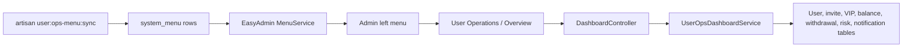

# User Ops Visibility Design

## Goal

Make the completed user operations features visible and testable from the EasyAdmin backend by adding a "User Operations" menu group, a dashboard overview page, and a repeatable menu synchronization command.

## Problem

The user subsystem now has backend controllers, views, JavaScript assets, and JSON APIs for account, invite, VIP, activation code, balance, commission, withdrawal, risk, security log, and notification outbox operations. However, the installed EasyAdmin menu data does not contain any `user/*` entries, so an administrator who logs in sees the original EasyAdmin menu and cannot discover the new functionality.

This creates a false impression that the work did not change the product, even though the backend routes and admin pages exist.

## Scope

Included:

- Add a visible "User Operations" parent menu in `system_menu`.
- Add child menu entries for existing user admin pages.
- Add a user operations dashboard page at `admin/user/dashboard/index`.
- Add dashboard statistics for core operations data.
- Add an idempotent artisan command to synchronize the menu.
- Add tests proving the menu command and dashboard behavior.

Excluded:

- Redesigning EasyAdmin's global layout.
- Building a public user frontend.
- Adding charts or heavy JavaScript dashboards.
- Changing P1-P7 business rules.
- Adding new payment, SMS, or payout providers.
- Changing existing admin auth semantics.

## User Experience

After login, the administrator should see a left-side menu group named "User Operations". The group should contain these entries:

- Overview
- User Accounts
- Invite Codes
- Invite Relations
- VIP Plans
- Activation Codes
- Activation Redemptions
- Balance Ledger
- Affiliate Commissions
- Withdrawal Review
- Risk Events
- Security Logs
- Notification Outbox

The "Overview" entry opens a compact dashboard with operational counts and links into the detailed pages. The dashboard should be plain and work-focused, matching EasyAdmin's existing table/admin style rather than introducing a new visual system.

## Dashboard Metrics

The first dashboard version should show counts and amounts that are already available from current tables:

- Total users.
- Today's registrations.
- Active VIP users.
- Pending withdrawal count.
- Pending payout count, covering `approved` and `payout_failed` withdrawals.
- Pending notification count.
- Retryable notification count.
- Risk event count.
- Today's affiliate commission amount.

Amounts must be formatted as fixed two-decimal strings.

## Architecture

Add a focused service, `UserOpsDashboardService`, responsible only for computing dashboard metrics. This keeps the controller thin and avoids spreading raw aggregate queries through the view layer.

Add an admin controller, `DashboardController`, under `App\Http\Controllers\admin\user`. It should follow the existing EasyAdmin admin-controller pattern: return a Blade view for normal page loads and JSON metrics for AJAX or JSON requests.

Add a console command, `user:ops-menu:sync`, in `routes/console.php` or a small command class if the plan determines a class fits the current code style better. The command should create or update menu rows idempotently and clear menu cache through `TriggerService::updateMenu()`.

## Menu Synchronization Rules

The command must:

- Create the parent menu if missing.
- Create or update each child menu by `href`.
- Preserve unrelated menu rows.
- Avoid duplicate rows if run more than once.
- Set each user menu row to enabled status.
- Use a stable order so the menu is predictable.
- Clear EasyAdmin menu cache after successful synchronization.

The command should not delete existing user menu rows in this phase. Non-destructive repair is enough for local testing and long-term operations.

## Data Flow

## Error Handling

The menu sync command should fail clearly if the `system_menu` table does not exist, because that means the EasyAdmin base install has not been imported. It should not silently create an incompatible replacement schema.

The dashboard should tolerate empty business tables and return zero counts or `0.00` amounts. It should not require sample data to render.

## Testing Strategy

Add focused feature tests:

- `user:ops-menu:sync` creates the parent and child menu rows.
- Running `user:ops-menu:sync` twice does not duplicate menu rows.
- Dashboard JSON returns all expected metric keys with zero values on an empty dataset.
- Dashboard JSON reflects seeded users, VIP users, withdrawals, notifications, risk events, and commissions.
- A logged-in administrator can open the dashboard HTML page.

Run the existing focused user-admin tests and the full SQLite suite after implementation.

## Acceptance Criteria

- Logging into `/admin` shows a "User Operations" menu group after running the sync command.
- The dashboard is reachable at `/admin/user/dashboard/index`.
- Existing user admin pages remain reachable from the menu.
- The menu sync command is safe to run repeatedly.
- No P1-P7 business rules are changed.
- Full test suite remains green.

## Recommended Implementation Order

1. Add failing menu sync tests.
2. Implement menu synchronization.
3. Add failing dashboard metric tests.
4. Implement dashboard service and controller.
5. Add dashboard Blade and JavaScript only as needed for EasyAdmin rendering.
6. Run review checklist, focused tests, full tests, and commit.

## Spec Self-Review

- Completion-marker scan: no unresolved markers remain.
- Consistency check: menu, dashboard, service, command, and tests all target the same visible backend goal.
- Scope check: this is one implementation phase focused on making existing operations visible, not adding new business capabilities.
- Ambiguity check: menu rows are idempotently created or updated by `href`; no destructive menu cleanup is included.
